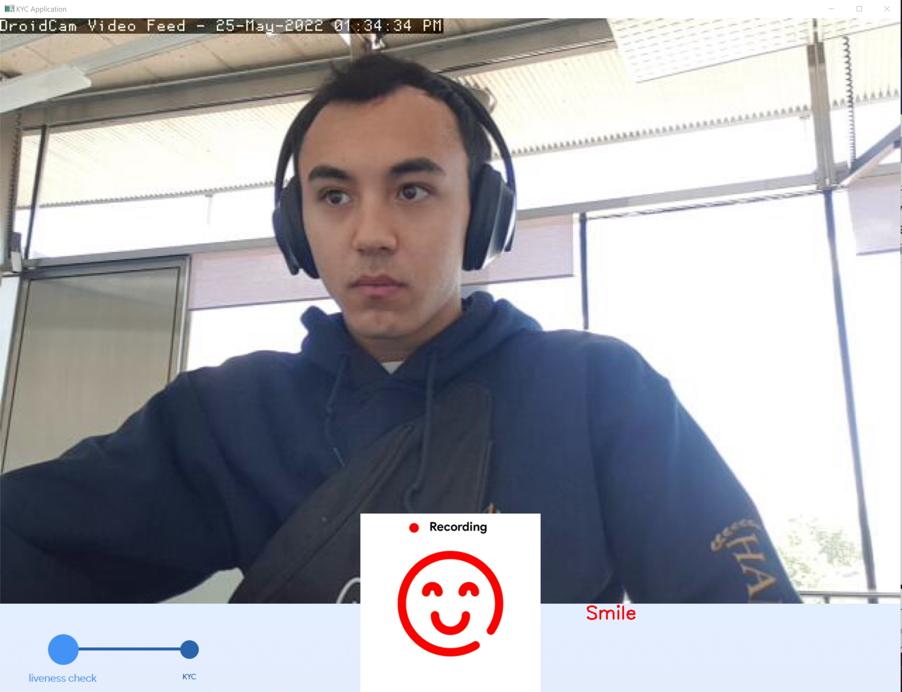

<div id="top"></div>

<!-- PROJECT LOGO -->
<br />
<div align="center">
  <a href="https://github.com/othneildrew/Best-README-Template">
    
  </a>

  <h3 align="center">KYC NFT Semester Project</h3>

  <p align="center">
    An awesome README template to jumpstart your projects!
    <br />
    <a href="https://github.com/Clementee/KYC-NFT-Semester-Project"><strong>"Explore the code"</strong></a>
    <br />
    <br />
  </p>
</div>

<!-- TABLE OF CONTENTS -->
<details>
  <summary>Table of Contents</summary>
  <ol>
    <li>
      <a href="#about-the-project">About The Project</a>
      <ul>
        <li><a href="#built-with">Built With</a></li>
      </ul>
    </li>
    <li>
      <a href="#getting-started">Getting Started</a>
      <ul>
        <li><a href="#prerequisites">Prerequisites</a></li>
        <li><a href="#installation">Installation</a></li>
      </ul>
    </li>
    <li><a href="#usage">Usage</a></li>
    <li><a href="#roadmap">Roadmap</a></li>
    <li><a href="#contributing">Contributing</a></li>
    <li><a href="#license">License</a></li>
    <li><a href="#contact">Contact</a></li>
    <li><a href="#acknowledgments">Acknowledgments</a></li>
  </ol>
</details>


<!-- ABOUT THE PROJECT -->
## About The Project

<div align="center">
    
</div>

This repository contains the code for my Bachelor semester Project at MMSPG, EPFL during the spring semester 2022. 
It consists of implementing a proof of concept for secure identification of users in platforms based on NFTs. 

The project can be decomposed into several subtasks:

* Implementing a function able to retrieve faces from a picture and reframe the picture to only keep the face.
* Implementing a function able to compare two faces and return the similarity rate between the two faces, using a pre-trained model.
* Implementing a function able to verify that the user is live in front of the camera, using a liveness check
* Implementing multiple function to detect stimulus of different natures to verify the liveness of the users (blinking eyes, smile, angry, turning face left/right)
* Implementing a clear visual interface to make the experience user-friendly 
* Implement security protocols to ensure informations aren't stored anywhere at the end of the process
* Implement security protocols to verify the person doing the liveness check is the same doing the face matching using again face comparison

<p align="right">(<a href="#top">back to top</a>)</p>

### Built With

* [Matplotlib](https://matplotlib.org/)
* [Numpy](https://numpy.org/)
* [OpenCV](https://opencv.org/)
* [PyGrabber](https://pypi.org/project/pygrabber/)
* [Keras](https://keras.io/)
* [SciPy](https://scipy.org/)
* [TensorFlow](https://www.tensorflow.org/?hl=fr)
* [FaceRecognition](https://pypi.org/project/face-recognition/)

<p align="right">(<a href="#top">back to top</a>)</p>

<!-- GETTING STARTED -->
## Getting Started

In order to setup your project and get a working local copy of the project, follow these steps.

### Prerequisites

To install all the libraries pre-requisites for the project:

* Need to have a working version of Python (preferably Python 3)
* Need to have pip installed at [https://pip.pypa.io/en/stable/installation/]
* All the rest of dependencies (preferably done in a venv, virtual environment)
  ```sh
  pip install -r requirements.txt
  ```

### Installation

_Below is an example of how you can instruct your audience on installing and setting up your app. This template doesn't rely on any external dependencies or services._

1. Clone the repo
   ```sh
   git clone https://github.com/Clementee/KYC-NFT-Semester-Project
   ```
2. Install NPM packages
   ```sh
   npm install
   ```

<p align="right">(<a href="#top">back to top</a>)</p>

<!-- USAGE EXAMPLES -->
## Usage

To run the project, simply run the main.py

```sh
python main.py
```

Once all the steps will be done, the program will stop and the result will appear in the command line (True if it worked, false otherwise)
<p align="right">(<a href="#top">back to top</a>)</p>

<!-- ACKNOWLEDGMENTS -->
## Acknowledgments

Useful resources that helped me worked on the project + modified source code from.

* [Use Tkinter to use camera to take pictures](https://github.com/andreaschiavinato/python_grabber)
* [Liveness Check Anti-Spoofing](https://github.com/juan-csv/face_liveness_detection-Anti-spoofing)
* [Face Comparison between two images](https://github.com/12345k/Multi-Face-Comparison)

<p align="right">(<a href="#top">back to top</a>)</p>
